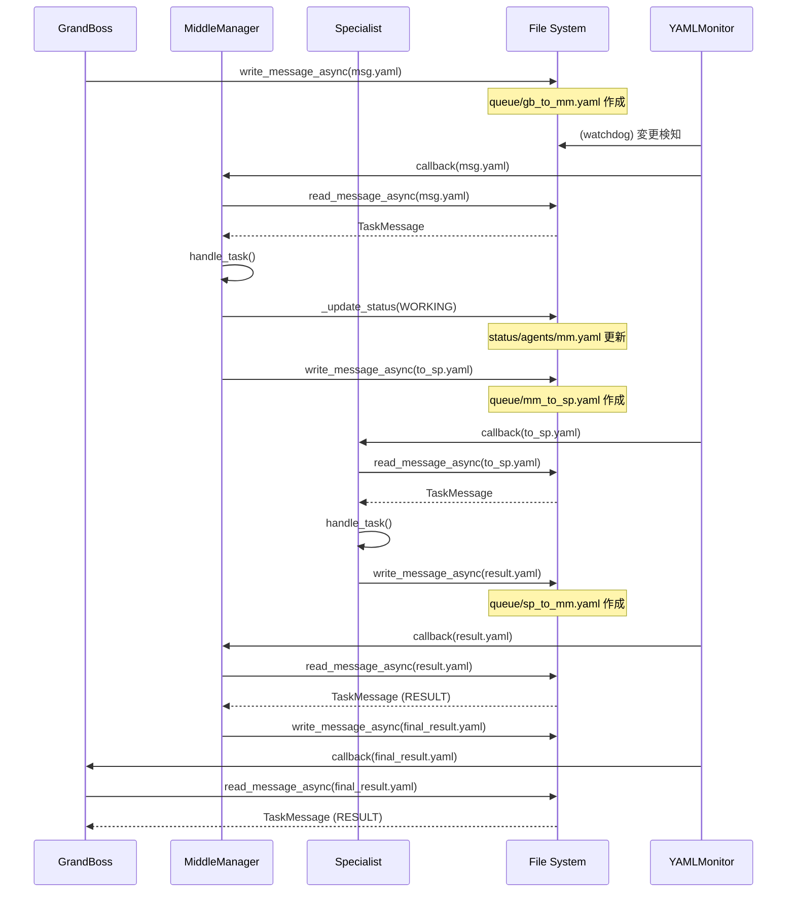
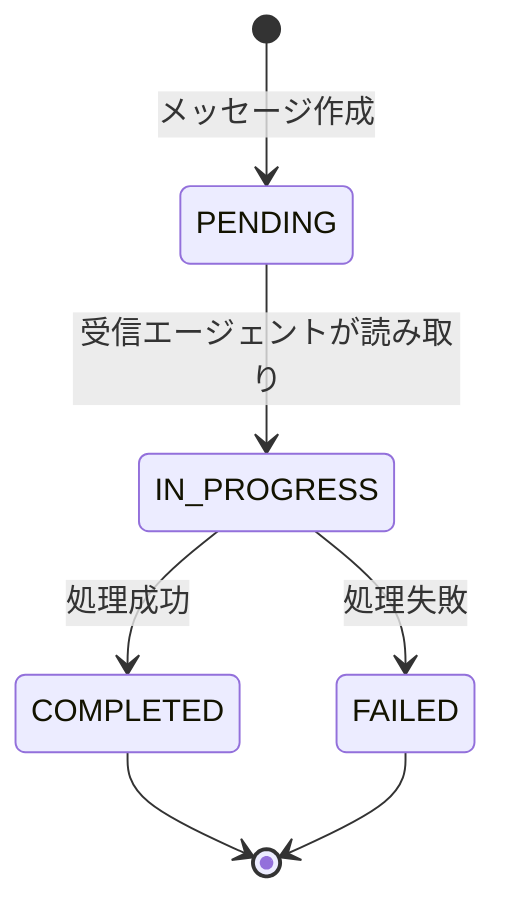

# PaneIO Design Document

## 概要

tmuxペインとの入出力を管理する `PaneIO` クラスの設計文書です。

**更新履歴:**
- 2025-02-02: YAMLプロトコル対応後の全体アーキテクチャを追加
- 初版: PaneIOクラス基本設計

## 既存実装の分析

### 現在の実装 (`orchestrator/core/pane_io.py`)

既存の `PaneIO` クラスには以下の機能が実装されています：

| 既存メソッド | 機能 |
|-------------|------|
| `send_message()` | ペインへのコマンド送信 |
| `get_response()` | 合言葉検出による応答取得（非同期） |
| `_parse_response()` | プロンプト行除去・パース処理 |
| `_is_prompt_line()` | シェルプロンプト行判定 |

### PjM指定の要件

| 要件メソッド | 対応既存メソッド | ステータス |
|-------------|-----------------|----------|
| `send_input` | `send_message` | ⚠️ 名前不一致 |
| `get_output` | `get_response` | ⚠️ 名前不一致 |
| `wait_for_response` | `get_response` | ⚠️ 名前不一致 |
| `clear_pane` | ❌ 未実装 | ❌ 新規追加 |
| `is_ready` | ❌ 未実装 | ❌ 新規追加 |

## 設計方針

### 方針1: メソッド名の統一

PjM指定のメソッド名に合わせ、以下のエイリアス/拡張を実装します：

```python
# 既存メソッドは残しつつ、PjM指定のメソッド名を追加
def send_input(self, pane_index: int, message: str) -> None:
    """send_messageのエイリアス（PjM指定名）"""
    return self.send_message(pane_index, message)

def get_output(self, pane_index: int, expected_marker: str, ...) -> str:
    """get_responseのエイリアス（PjM指定名）"""
    return await self.get_response(pane_index, expected_marker, ...)

def wait_for_response(self, pane_index: int, expected_marker: str, ...) -> str:
    """get_outputのエイリアス（待機を強調）"""
    return await self.get_output(pane_index, expected_marker, ...)
```

### 方針2: バイナリデータ対応

現状の `tmux_session_manager.py` では `subprocess.run(text=True)` が使用されており、テキストのみを扱います。

**決定**: Phase 1ではテキストのみをサポートします。

**理由**:
- Claude Codeとの通信はテキストベースで十分
- tmuxのキャプチャは基本的にテキスト
- バイナリ対応は将来的な拡張として考慮

### 方針3: 新規メソッドの実装

#### `clear_pane()` メソッド

ペインの内容をクリアする機能です。

```python
def clear_pane(self, pane_index: int) -> None:
    """ペインの画面をクリアします。

    tmuxの send-keys -t {pane} 'clear' Enter を使用します。
    """
```

#### `is_ready()` メソッド

ペインがコマンドを受信可能な状態か確認します。

```python
def is_ready(self, pane_index: int) -> bool:
    """ペインがコマンド受信可能か確認します。

    プロンプトが表示されているかを判定します。
    """
```

## 実装仕様

### クラス図

```
┌─────────────────────────────────────────────────────────┐
│                      PaneIO                              │
├─────────────────────────────────────────────────────────┤
│ - _tmux: TmuxSessionManager                             │
│                                                         │
│ + send_input(pane_index, message): None                 │
│ + send_message(pane_index, message): None               │
│                                                         │
│ + get_output(pane_index, marker, timeout, ...): str     │
│ + get_response(pane_index, marker, timeout, ...): str   │
│ + wait_for_response(pane_index, marker, ...): str       │
│                                                         │
│ + clear_pane(pane_index): None                          │
│ + is_ready(pane_index): bool                            │
│                                                         │
│ - _parse_response(raw_output, marker): str              │
│ - _is_prompt_line(line): bool                           │
└─────────────────────────────────────────────────────────┘
```

### 型ヒント

全メソッドに適切な型ヒントを付与します。

```python
from typing import Final

DEFAULT_TIMEOUT: Final[float] = 30.0
DEFAULT_POLL_INTERVAL: Final[float] = 0.5

async def get_output(
    self,
    pane_index: int,
    expected_marker: str,
    timeout: float = DEFAULT_TIMEOUT,
    poll_interval: float = DEFAULT_POLL_INTERVAL,
) -> str:
    ...
```

## セキュリティ考慮事項

### 1. コマンドインジェクション対策

`tmux send-keys -l` (リテラルモード) を使用するため、シェルインジェクションのリスクはありません。

### 2. bypass permissions (--dangerously-skip-permissions) 対応

このフラグは `cc_process_launcher.py` で既に使用されています。`PaneIO` クラスでは、起動済みのプロセスとの通信を行うため、直接の関与はありません。

## テスト計画

### 単体テスト

1. `send_input()` - 各種文字列、特殊文字、Unicode
2. `get_output()` - 合言葉検出、タイムアウト、プロンプト除去
3. `wait_for_response()` - 非同期待機、ポーリング
4. `clear_pane()` - コマンド送信確認
5. `is_ready()` - プロンプト検出

### 統合テスト

- `TmuxSessionManager` との連携
- 実際の tmux セッションでの動作確認

## トレードオフ

| 項目 | 選択 | 理由 |
|------|------|------|
| メソッド名 | 両方サポート | 既存コード互換性 + PjM要件 |
| バイナリ対応 | Phase 1では未実装 | Claude Code通信はテキストで十分 |
| プロンプト検出 | 正規表現パターン | 柔軟性 vs シンプルさ |
| ポーリング方式 | asyncio.sleep | シンプルで信頼性が高い |

## マイルストーン

1. **Design Doc 承認** ← 現在
2. 新規メソッド実装 (`clear_pane`, `is_ready`)
3. エイリアスメソッド実装 (`send_input`, `get_output`, `wait_for_response`)
4. テスト実装
5. ドキュメント更新
6. コミット & レビュー依頼

## 参考

- 既存実装: `orchestrator/core/pane_io.py`
- テスト: `tests/test_core/test_pane_io.py`
- tmuxマニュアル: `man tmux` (send-keys, capture-pane)

---

# YAMLプロトコル対応アーキテクチャ

## 概要

PaneIOはYAMLベースの通信プロトコルと統合され、エージェント間の非同期メッセージングを可能にしています。

## コンポーネント構成

### 1. YAML通信プロトコル (`yaml_protocol.py`)

ファイルベースのキューイングシステムを使用したエージェント間通信を実現します。

#### データモデル

```python
# メッセージタイプ
class MessageType(str, Enum):
    TASK = "task"      # タスク割り当て
    INFO = "info"      # 情報通知
    RESULT = "result"  # 処理結果
    ERROR = "error"    # エラー通知

# メッセージステータス
class MessageStatus(str, Enum):
    PENDING = "pending"
    IN_PROGRESS = "in_progress"
    COMPLETED = "completed"
    FAILED = "failed"

# エージェント状態
class AgentState(str, Enum):
    IDLE = "idle"
    WORKING = "working"
    COMPLETED = "completed"
    ERROR = "error"
```

#### TaskMessageデータクラス

```python
@dataclass
class TaskMessage:
    id: str                    # メッセージID
    from_agent: str            # 送信元エージェント名
    to: str                    # 送信先エージェント名
    type: MessageType          # メッセージタイプ
    status: MessageStatus      # メッセージステータス
    content: str               # メッセージ内容
    timestamp: str             # タイムスタンプ（ISO 8601）
    metadata: dict[str, Any]   # 追加メタデータ
```

#### YAMLファイル例

```yaml
# queue/grand_boss_to_middle_manager.yaml
id: msg-a1b2c3d4
from: grand_boss
to: middle_manager
type: task
status: pending
content: |
  プロジェクトの分析を実行してください
timestamp: "2025-02-02T12:00:00"
metadata:
  priority: high
  category: analysis
```

### 2. YAMLファイル監視 (`yaml_monitor.py`)

watchdogベースのリアルタイムファイル監視を実現します。

#### YAMLMonitorクラス

```python
class YAMLMonitor:
    """YAMLファイル監視クラス

    指定されたディレクトリ内のYAMLファイルを監視し、
    変更が検出されたときにコールバックを呼び出します。
    """

    def start(self) -> None:
        """監視を開始します（ブロックしません）"""

    def stop(self) -> None:
        """監視を停止します"""

    def is_running(self) -> bool:
        """監視が実行中か確認します"""
```

#### 使用例

```python
# メッセージ受信時のコールバック
async def on_message_received(yaml_file: str):
    message = await read_message_async(yaml_file)
    if message and message.status == MessageStatus.PENDING:
        # メッセージ処理
        await handle_message(message)

# 監視開始
monitor = YAMLMonitor("queue", on_message_received, ".yaml")
monitor.start()
```

### 3. CCAgentBase統合 (`cc_agent_base.py`)

全エージェントの基底クラスでYAML通信をサポートします。

#### YAML通信対応メソッド

```python
class CCAgentBase(ABC):
    # --- YAML通信対応メソッド ---

    def _get_queue_path(self, to_agent: str) -> Path:
        """YAML通信ファイルのパスを取得します
        queue/{from}_to_{to}.yaml
        """

    def _get_status_path(self) -> Path:
        """ステータスファイルのパスを取得します
        status/agents/{agent_name}.yaml
        """

    async def _read_yaml_message(
        self, from_agent: str | None = None
    ) -> TaskMessage | None:
        """YAMLメッセージを読み込みます"""

    async def _write_yaml_message(
        self, to_agent: str, content: str, ...
    ) -> str:
        """YAMLメッセージを書き込みます"""

    async def _update_status(
        self, state: AgentState, ...
    ) -> None:
        """ステータスを更新します"""

    async def _check_and_process_messages(self) -> list[TaskMessage]:
        """自分宛のメッセージを確認して処理します"""
```

#### ステータスファイル例

```yaml
# status/agents/middle_manager.yaml
agent_name: middle_manager
state: working
current_task: msg-a1b2c3d4
last_updated: "2025-02-02T12:05:00"
statistics:
  tasks_completed: 42
  tasks_failed: 3
  uptime_seconds: 3600
```

## アーキテクチャ図

### システム全体構成

```
┌─────────────────────────────────────────────────────────────────┐
│                    Orchestrator System                          │
├─────────────────────────────────────────────────────────────────┤
│                                                                  │
│  ┌─────────────┐    ┌─────────────┐    ┌─────────────┐         │
│  │ GrandBoss   │    │MiddleManager│    │ Specialist  │         │
│  │   Agent     │    │   Agent     │    │   Agent     │         │
│  │             │    │             │    │             │         │
│  │ CCAgentBase │    │ CCAgentBase │    │ CCAgentBase │         │
│  └──────┬──────┘    └──────┬──────┘    └──────┬──────┘         │
│         │                  │                  │                 │
│         │ send_to()        │ send_to()        │                 │
│         ▼                  ▼                  ▼                 │
│         └──────────────────┴──────────────────┘                 │
│                           │                                     │
│                           ▼                                     │
│                  ┌─────────────────┐                           │
│                  │ CCClusterManager│                           │
│                  │                 │                           │
│                  │  ┌───────────┐  │                           │
│                  │  │  PaneIO  │  │                           │
│                  │  └───────────┘  │                           │
│                  └────────┬────────┘                           │
│                           │                                     │
│                           ▼                                     │
│                  ┌─────────────────┐                           │
│                  │ tmux Sessions   │                           │
│                  └─────────────────┘                           │
│                                                                  │
├─────────────────────────────────────────────────────────────────┤
│                    YAML Communication                           │
├─────────────────────────────────────────────────────────────────┤
│                                                                  │
│  queue/                                                          │
│  ├── grand_boss_to_middle_manager.yaml                          │
│  ├── middle_manager_to_specialist.yaml                          │
│  └── specialist_to_middle_manager.yaml                          │
│                                                                  │
│  status/agents/                                                  │
│  ├── grand_boss.yaml                                            │
│  ├── middle_manager.yaml                                        │
│  └── specialist.yaml                                            │
│                                                                  │
├─────────────────────────────────────────────────────────────────┤
│                    YAML Monitor                                  │
├─────────────────────────────────────────────────────────────────┤
│                                                                  │
│  ┌─────────────────┐      watch                                │
│  │ YAMLMonitor     │─────────────────────────────┐              │
│  │                 │                             │              │
│  │ - watchdog      │              ┌──────────────┴──────────┐  │
│  │ - callbacks     │              │  queue/               │  │
│  └─────────────────┘              │  *.yaml 変更検知        │  │
│                                   └──────────────────────────┘  │
│                                                                  │
└─────────────────────────────────────────────────────────────────┘
```

### エージェント間通信シーケンス



### メッセージライフサイクル



## Worktree対応

各エージェントはWorktree内で実行され、YAMLファイルを通じて通信します。

### Worktreeディレクトリ構造

```
TARGET_PROJECT_PATH/
├── .orchestrator-worktrees/
│   ├── eng1/                    # Engineer 1 worktree
│   │   ├── queue/               # YAMLメッセージキュー
│   │   │   ├── gb_to_mm.yaml
│   │   │   └── mm_to_gb.yaml
│   │   └── status/
│   │       └── agents/
│   │           ├── grand_boss.yaml
│   │           └── middle_manager.yaml
│   └── eng2/                    # Engineer 2 worktree
│       └── ...
```

### CCAgentBaseのWorktree対応

```python
class CCAgentBase(ABC):
    def _get_queue_path(self, to_agent: str) -> Path:
        """Worktree内のqueueディレクトリへのパスを返す"""
        from_agent = self._name
        filename = f"{from_agent}_to_{to_agent}.yaml"
        return Path("queue") / filename  # Worktree相対パス

    def _get_status_path(self) -> Path:
        """Worktree内のstatusディレクトリへのパスを返す"""
        filename = f"{self._name}.yaml"
        return Path("status") / "agents" / filename
```

## 非同期I/Oの実装

ファイルI/Oは非同期で実行され、エージェントの処理をブロックしません。

### 非同期読み書き

```python
async def read_message_async(path: Path | str) -> TaskMessage | None:
    """非同期でメッセージを読み込みます

    I/Oをブロックしないようにスレッドプールで実行
    """
    loop = asyncio.get_event_loop()
    return await loop.run_in_executor(None, TaskMessage.from_yaml, path)

async def write_message_async(message: TaskMessage, path: Path | str) -> None:
    """非同期でメッセージを書き込みます

    I/Oをブロックしないようにスレッドプールで実行
    """
    loop = asyncio.get_event_loop()
    await loop.run_in_executor(None, message.to_yaml, path)
```

## 設計上の考慮事項

### 1. ファイルベース通信のメリット

| 項目 | 説明 |
|------|------|
| **デバッグ容易性** | YAMLファイルは人間が読める |
| **永続性** | システムクラッシュ後もメッセージ保持 |
| **透明性** | 通信状態をファイルで直接確認可能 |
| **拡張性** | 新しいエージェントを簡単に追加 |

### 2. 監視パフォーマンス

| 項目 | 説明 |
|------|------|
| **watchdog使用** | OSネイティブのファイルシステムイベント |
| **非同期コールバック** | メインスレッドをブロックしない |
| **マルチパス対応** | MultiPathYAMLMonitorで複数監視 |

### 3. ステータス管理

各エージェントは定期的にステータスを更新し、全体の状態を可視化します。

```yaml
# ステータス更新の例
agent_name: middle_manager
state: working
current_task: msg-a1b2c3d4
last_updated: "2025-02-02T12:10:00"
statistics:
  tasks_completed: 42
  tasks_failed: 3
  messages_sent: 50
  messages_received: 55
```

## 実装モジュール一覧

| モジュール | 説明 |
|-----------|------|
| `orchestrator/core/pane_io.py` | tmuxペイン入出力（PaneIOクラス） |
| `orchestrator/core/yaml_protocol.py` | YAML通信プロトコル定義 |
| `orchestrator/core/yaml_monitor.py` | YAMLファイル監視 |
| `orchestrator/agents/cc_agent_base.py` | エージェント基底クラス（YAML統合） |
| `orchestrator/core/cc_cluster_manager.py` | クラスタ管理（PaneIO使用） |

## 関連ドキュメント

- [Architecture Document](../architecture.md) - 全体アーキテクチャ
- [Communication Spec](../specs/communication.md) - 通信プロトコル詳細
- [Directory Structure](../specs/directory-structure.md) - ディレクトリ構造
